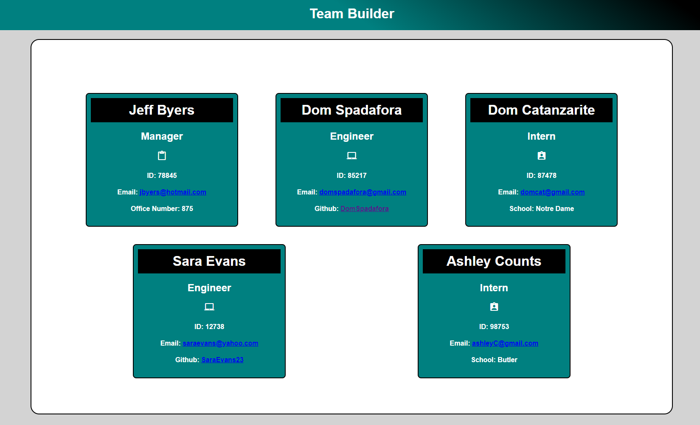

# Team Profile Generator 

  

  ## Description
  This application give your the ability to generate a team profile for each of your employees based on user input. After input has been entered, a newly created hted html page is produced with the team members.

  ## Table of Contents
  1. [Installation](#installation)
  2. [Usage](#usage)
  3. [License](#license)
  4. [Contributing](#contributing)
  5. [Tests](#tests)
  6. [Questions](#questions)

  ## Installation
  To install the necessary dependencies, run the following command:
  New user will need to clone the repository from Github and then download node. You will also need to install NPM Inquirer to use the application. 

  ## Usage
  Use inquirer from the command line to begin entering in questions that are prompted. Once all members of your team have been entered, select the finish building my team prompt. Below is a screen shot of the final product. Please click on the demo link to view a walk through video. [Video Demonstration](https://drive.google.com/file/d/1SHlodGhotl7OLmtfN61W94doD-zvYFUg/view)

  
  

  ## License 
  This project is licensed under the MIT license.

  ## Contributing
  Only contributors were myself.

  ## Tests
  To run tests, run the following command:
  You will need Jest to run 'npm test' in the command line for testing.
  
  ## Questions
  If you have any questions about this repo, open an issue or contact me directly at [domspadafora@gmail.com](mailto:domspadafora@gmail.com).
  You can find more of my work at [DomSpadafora](https://www.github.com/DomSpadafora).

